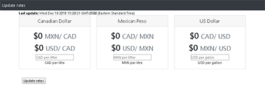
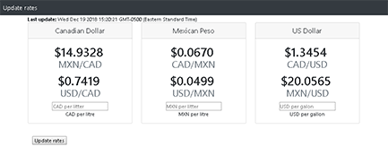
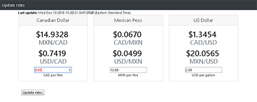
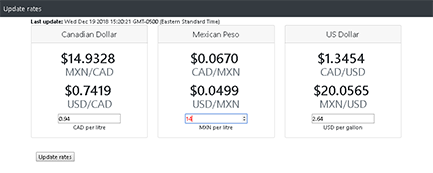

# Gas price converter
> **Cretaed by:**     Juan I Diaz (jdi@idiaz.ca)

> **Date:**           December 2018

## DESCRIPTION:
This dynamic page converts price gases on a simple way amongst either Canadian Dollars or Mexican Peso (per liter) or US Dollars (per gallon).

## INSTRUCTIONS:

1. Load the page and wait for the currency rates to populate.
2. Enter the value of gas on the current field and the other two fields will update with the correct conversion. 

## SCREENSHOTS

## BUILDING TOOLS
- HTML, CSS
- Javascript and jQuery
- API questries using AJAX
- Bootstrap v4

## QUESTIONS OR COMMENTS
- API powered by [RapidAPI](https://rapidapi.com/)
- Feel free to contact the developer @ <jdi@idiaz.ca>!
- See the project [live](https://juanidiaz.github.io/sandBox/gas/gas.html).

